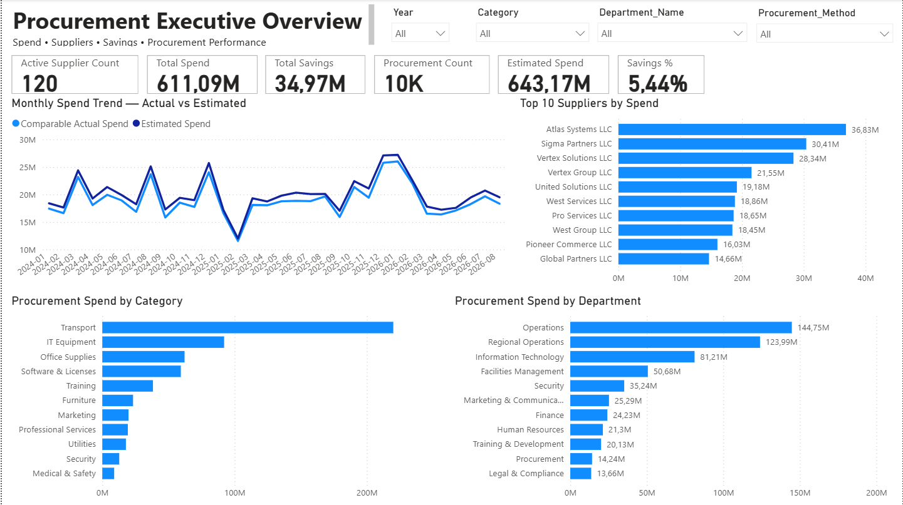
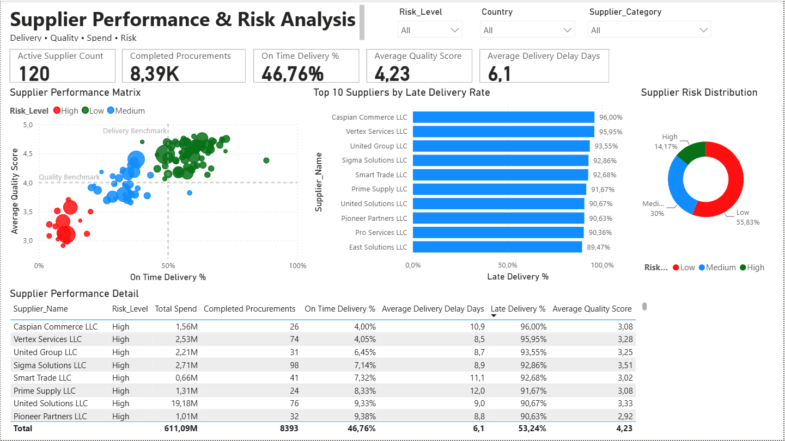
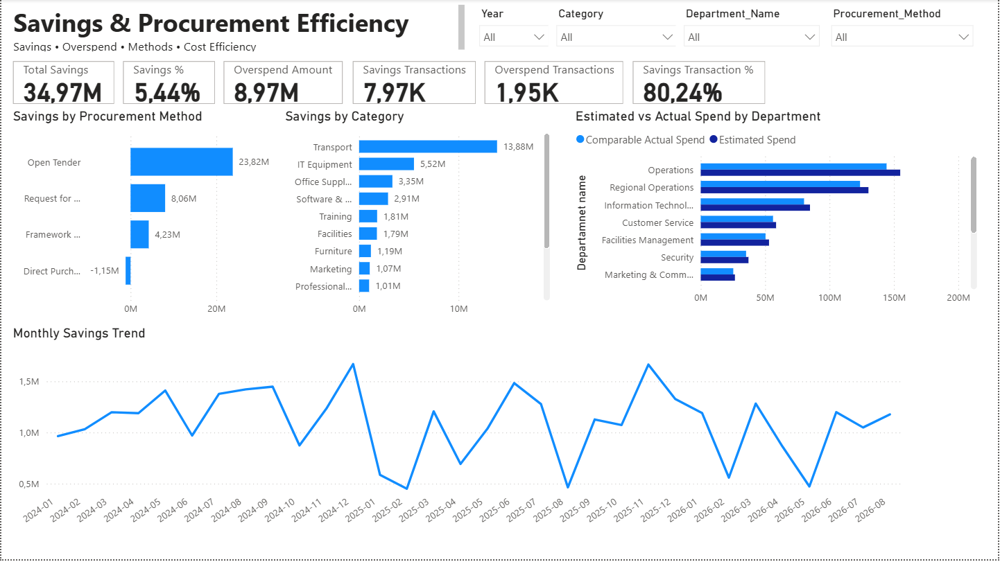
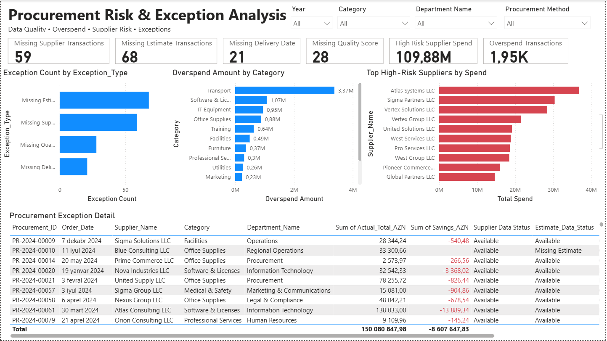

# Procurement Analytics Portfolio Project

A complete procurement analytics portfolio project built with **MySQL** and **Power BI**. The project covers data profiling, cleaning, dimensional modeling, DAX, SQL analysis, supplier performance, savings analysis, procurement risk, exception monitoring, and advanced SQL window functions.

> **Portfolio note:** The dataset is synthetic and was created for learning/demo purposes. It does not contain confidential company data and does not represent a real organization.

## Project objectives

The project answers practical procurement questions such as:

- How much was spent versus estimated?
- How much savings or overspend was generated?
- Which procurement methods and categories create the most savings?
- Which suppliers combine high spend with weak quality or delivery performance?
- Where is high-risk supplier exposure concentrated?
- Which months experienced the largest month-over-month spend changes?
- What data-quality exceptions should management monitor?

## Tech stack

- **MySQL 8.0** — data staging, cleaning view, joins, CTEs, aggregation, CASE expressions, ranking, window functions, risk segmentation
- **Power BI** — Power Query, star schema, DAX measures, KPI cards, supplier performance matrix, savings and risk dashboards
- **Excel/CSV** — source data and supporting dimensions

## Dataset

The model contains:

- **10,000** procurement transactions
- **120** suppliers
- **12** departments
- **13** procurement categories represented in transactions
- Data spanning **2024–2026**

Source files are available in [`data/`](data/).

## Data quality findings

Initial profiling identified intentional data-quality issues:

| Check | Result |
|---|---:|
| Total transactions | 10,000 |
| Missing supplier IDs | 59 |
| Missing estimated prices | 68 |
| Completed transactions missing delivery date | 21 |
| Completed transactions missing quality score | 28 |
| Estimate coverage | 99.32% |

To preserve all 10,000 records during MySQL import, the transaction CSV is first loaded into a **text-based staging table**, then converted into the typed raw table with controlled `NULLIF`, `CAST`, and `STR_TO_DATE` logic.

## Core KPIs

| KPI | Result |
|---|---:|
| Total Spend | 611.09M AZN |
| Estimated Spend | 643.17M AZN |
| Total Savings | 34.97M AZN |
| Savings % | 5.44% |
| Procurement Count | 10,000 |
| Active Suppliers | 120 |
| Estimate Coverage | 99.32% |

`Total Spend` includes transactions without an estimate. For like-for-like estimate comparisons, the project uses **Comparable Actual Spend**, which only includes transactions where an estimate exists.

## Key business insights

### Procurement methods

- **Open Tender** generated approximately **23.82M AZN** in savings with an **8.65%** savings rate.
- **Request for Quotation** generated approximately **8.06M AZN** in savings.
- **Framework Agreement** generated approximately **4.23M AZN** in savings.
- **Direct Purchase** produced approximately **-1.15M AZN** net savings, equivalent to **-1.03%**, indicating overall overspend versus estimate.

### Category performance

- **Transport** is the largest spend category at approximately **219.97M AZN**.
- Transport also generated approximately **13.88M AZN** in savings.
- **IT Equipment** ranked second in savings at approximately **5.52M AZN**.

### Supplier risk exposure

- High-risk supplier spend totals approximately **109.88M AZN**.
- **Transport** accounts for approximately **80.82%** of all high-risk supplier spend.
- Within high-risk Transport activity, average quality is approximately **3.28/5** and the late-delivery rate is approximately **89.10%**.

### Supplier segmentation

Suppliers were segmented using the same benchmarks as the Power BI performance matrix:

- On-time delivery benchmark: **50%**
- Quality benchmark: **4.0 / 5**

| Segment | Suppliers | Spend | Share of analyzed supplier spend |
|---|---:|---:|---:|
| High Performer | 60 | 277.23M AZN | 45.62% |
| Critical Supplier | 38 | 194.91M AZN | 32.07% |
| Delivery Risk | 21 | 134.22M AZN | 22.08% |
| Quality Risk | 1 | 1.38M AZN | 0.23% |

Critical Supplier + Delivery Risk exposure represents approximately **54.15%** of analyzed supplier spend.

### Monthly trend analysis

Using `LAG()` to calculate month-over-month spend changes:

- **2025-03:** +57.07%
- **2024-08:** +38.17%
- **2024-03:** +36.26%
- **2024-12:** +34.27%
- **2025-10:** +34.03%

## Power BI dashboard

### 1. Procurement Executive Overview



Focus: executive KPIs, spend trend, category spend, supplier spend, and department spend.

### 2. Supplier Performance & Risk Analysis



Focus: on-time delivery, quality, supplier risk, late-delivery ranking, risk distribution, and supplier-level detail.

### 3. Savings & Procurement Efficiency



Focus: savings, overspend, procurement method efficiency, category savings, monthly savings, and estimated vs actual spend.

### 4. Procurement Risk & Exception Analysis



Focus: missing data, overspend, high-risk supplier exposure, exception counts, and transaction-level exception review.

## Data model

Power BI uses a star-style model:

```text
                     Dim_Date
                        |
                        1
                        |
                        *
Dim_Supplier  1 ---- * Fact_Procurement * ---- 1 Dim_Category
                        |
                        *
                        |
                        1
                  Dim_Department
```

Relationships are **many-to-one**, active, and use **single-direction filtering** from dimensions to the fact table.

## SQL skills demonstrated

The SQL scripts demonstrate:

- Data staging and controlled type conversion
- Data-quality profiling
- Views
- `INNER JOIN`
- `GROUP BY`
- Conditional aggregation
- `CASE`
- `NULLIF`
- Common Table Expressions (`WITH`)
- `RANK()`
- `PARTITION BY`
- `LAG()`
- Windowed aggregation
- Month-over-month analysis
- Supplier segmentation
- High-risk exposure analysis

See the full SQL workflow in [`sql/`](sql/).

## Repository structure

```text
procurement-analytics-portfolio/
├── README.md
├── UPLOAD_TO_GITHUB.md
├── data/
│   ├── procurement_transactions_raw.csv
│   ├── suppliers.csv
│   ├── departments.csv
│   ├── categories.csv
│   └── README.md
├── sql/
│   ├── 01_create_schema_and_tables.sql
│   ├── 02_load_staging_to_raw.sql
│   ├── 03_data_quality_checks.sql
│   ├── 04_cleaning_view.sql
│   ├── 05_kpi_analysis.sql
│   ├── 06_category_analysis.sql
│   ├── 07_supplier_performance.sql
│   ├── 08_monthly_trends.sql
│   ├── 09_risk_exposure.sql
│   ├── 10_supplier_segmentation.sql
│   └── 11_budget_validation.sql
├── docs/
│   ├── data_dictionary.md
│   ├── business_insights.md
│   └── powerbi_dax_measures.md
├── images/
│   ├── 01_executive_overview.png
│   ├── 02_supplier_performance.png
│   ├── 03_savings_efficiency.png
│   └── 04_risk_exceptions.png
└── powerbi/
    └── README.md
```

## How to reproduce the MySQL workflow

1. Open MySQL Workbench.
2. Run [`sql/01_create_schema_and_tables.sql`](sql/01_create_schema_and_tables.sql).
3. Import `suppliers.csv`, `departments.csv`, and `categories.csv` into their existing tables using **Table Data Import Wizard**.
4. Import `procurement_transactions_raw.csv` into `procurement_transactions_stage` rather than directly into the typed transaction table.
5. Run [`sql/02_load_staging_to_raw.sql`](sql/02_load_staging_to_raw.sql).
6. Confirm the raw transaction count is **10,000**.
7. Run the remaining scripts in numeric order.

## Power BI file

The interactive Power BI report is available in the repository:

[Download the Power BI file](powerbi/Procurement_Analytics.pbix)

The report contains four analytical pages:

- Executive Overview
- Supplier Performance & Risk Analysis
- Savings & Procurement Efficiency
- Procurement Risk & Exception Analysis

Dashboard screenshots are available in the [`images/`](images/) folder.

## Important analytical limitation

The `annual_budget_azn` values in the department dimension are not on the same apparent scale as annual procurement spend. For example, the combined department budget is **18.15M AZN**, while annual procurement spend is much larger. Therefore, budget utilization is treated as a **business-definition / scale validation issue**, not as a validated conclusion that departments exceeded budget by several hundred percent.

## Suggested GitHub topics

`power-bi` · `mysql` · `sql` · `data-analysis` · `business-intelligence` · `procurement` · `dashboard` · `dax` · `power-query` · `portfolio-project`
